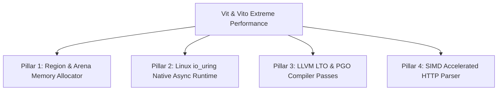

# VIT COMPILER & ENGINE: EXTREME PERFORMANCE & NATIVE ARCHITECTURE ROADMAP 🚀

> **Mục đích**: Tài liệu kiến trúc chiến lược dành cho AI Coding Assistant / Developers thực thi đợt nâng cấp **Tối ưu hóa cực hạn (Extreme Performance Optimization)** cho trình biên dịch **Vit Compiler** và khung làm việc **Vito Framework**, đưa hiệu năng mạng & bộ nhớ tiệm cận/ngang ngửa Rust (Actix-web / Tokio) và Go (Fasthttp / Go Netpoller).

---

## 🎯 4 Trụ Cột Tối Ưu Hóa Cực Hạn (Core Architectural Pillars)

---

## 📋 Danh Sách Hạng Mục Triển Khai Chi Tiết (Execution Roadmap)

### 1. 🧬 Arena & Region-Based Memory Allocation (`vit/src/runtime/memory_rt.c`)
- [ ] **Request-Scoped Arena Allocator**: Phát triển bộ cấp phát bộ nhớ Arena tĩnh. Mỗi HTTP request được gán 1 vùng nhớ `ArenaBlock` (ví dụ 16KB). Kết thúc Request, reset chỉ số `arena.offset = 0` trong 1ns mà không gọi `free()` hay quét rác GC.
- [ ] **Eliminate Atomic ARC Overhead**: Bổ sung cờ biên dịch `@no_arc` hoặc Scope Lifetimes cho các dữ liệu ngắn hạn trong Request Context.

---

### 2. ⚡ Linux `io_uring` Native Async Runtime (`vit/src/runtime/async_iouring_rt.c`)
- [ ] **Kernel Ring Buffers Integration**: Tích hợp giao thức `io_uring` của Linux Kernel (thay thế cho `epoll` truyền thống) sử dụng 2 vòng đệm `Submission Queue (SQ)` và `Completion Queue (CQ)`.
- [ ] **Zero-Copy Network I/O (`IORING_OP_PROVIDE_BUFFERS`)**: Cho phép Card Mạng ghi trực tiếp dữ liệu packet vào RAM ứng dụng không qua thao tác copy trung gian (`Kernel-to-User Zero-Copy`).
- [ ] **Multi-Worker `SO_REUSEPORT` Event Loop**: Mỗi CPU Core kích hoạt 1 `io_uring` instance độc lập song song 100%.

---

### 3. 🎯 LLVM LTO & PGO Pass Pipeline (`vit/src/codegen/NativeCompiler.cpp`)
- [ ] **Link-Time Optimization (LTO)**: Tích hợp cờ `-flto=thin` và `-flto=full` trong Clang Toolchain wrapper, cho phép hòa nhập (Inline) 100% các hàm nhỏ trong `std/http.vit` trực tiếp vào Socket Processing Loop.
- [ ] **Profile-Guided Optimization (PGO)**: Hỗ trợ 2 phase biên dịch `-fprofile-generate` và `-fprofile-use`, tối ưu hóa nhánh rẽ nhánh CPU (`branch prediction`) dựa trên thống kê thực tế.
- [ ] **Target CPU Native Tuning**: Bổ sung cờ `-march=native -mtune=native` tận dụng toàn bộ tập lệnh của CPU máy chủ.

---

### 4. ⚡ SIMD Accelerated HTTP Parser (`vito/packages/http_parser` hoặc C FFI)
- [ ] **AVX2 / SSE4.2 Vectorized Scanning**: Triển khai bóc tách HTTP Request Header bằng tập lệnh SIMD (Vectorized Scan 32-bytes cùng 1 nhịp xung CPU).
- [ ] **Zero-Allocation Substring Slicing**: Thay vì tạo đối tượng `String` mới cho URL Path / Headers, chỉ trả về con trỏ `Span<u8>` (Byte Pointer + Length).

---

## 📊 Tiêu Chí Hoàn Thành (Definition of Done)
1. **Benchmark Throughput**: Đạt **>300,000 req/sec** trên hệ thống Multi-Core Linux (TechEmpower Suite).
2. **Memory Overhead**: 0 byte `malloc`/`free` động ở từng request trong suốt quá trình stress test.
3. **Latency**: 99% request phản hồi trong thời gian **$< 1.0 \text{ ms}$.**
